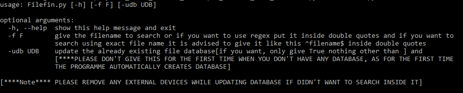
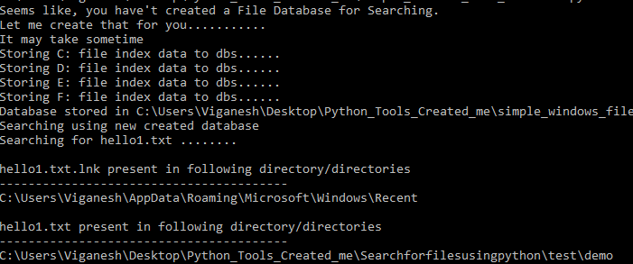
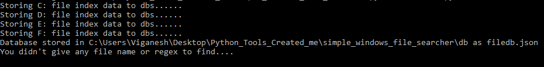
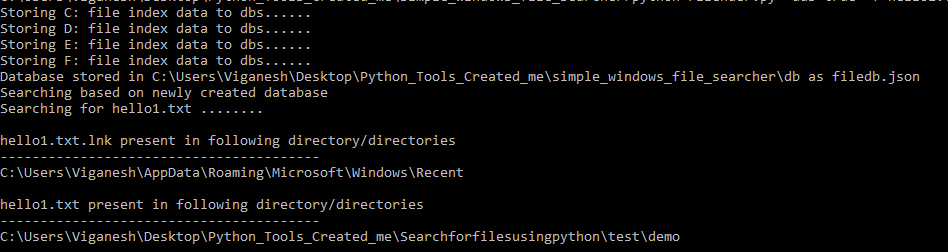
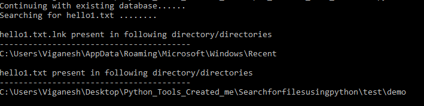
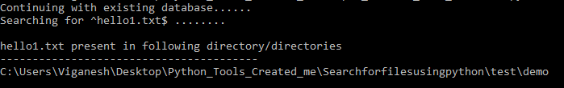

# Fi[le]nder

Filender is a simple windows file searching tool built using python.
It uses Json file format to store the all filepaths, so that searching can be pretty fast.

## Installation

Use the package manager [pip](https://pip.pypa.io/en/stable/) to install requirements or dependencies.

```bash
pip3 install -r requirements.txt
```
Then run the tool to see help description
```bash
python Filender.py -h
```
Output:





## Usage
-----------For the first time using this tool-------------
```python
>> python Filender.py -f hello1.txt
```
Output:




-----------Want to update existing database---------------
```python
>> python Filender.py -udb true (or) python Filender.py -udb true -f hello1.txt
```
Output for "Filender.py -udb true":



Output for python "Filender.py -udb true -f hello1.txt" update and search at the same time:



-----------Search using existing database-------------------------
```python
>> python Filender.py -f hello1.txt
```
Output:



----------Using Regular expression----------
Example using regex to find specific file

```python 
>> python Filender.py -f "^hello1.txt$"
```
Output:



